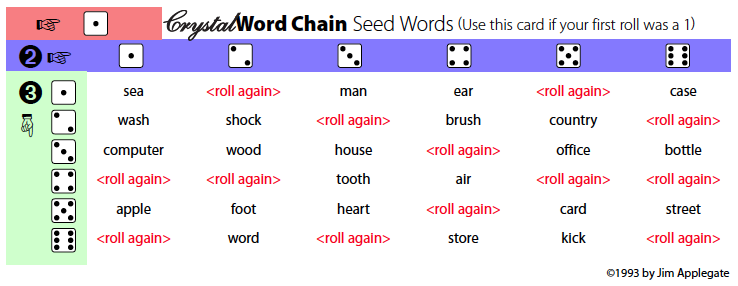

I designed this game years ago with a friend of mine (thank you Emily!). Back in the day, I made a bunch of physical copies of it and gave them to friends and family. I decided it was time I made it into a free printable game and make it available to everyone. I did a little searching online and found that there are other games that people call "Word Chain" where you create a chain of words by starting the next link of the chain using the last letter of the previous word (e.g. time &gt; egg &gt; game, etc.). This game is different, so I hope I don't cause any confusion.

This game connects words using common two-word phrases or compound words (e.g. tea &gt; tea time &gt; time machine &gt; machine learning, etc.). Also, it uses a grid system into which the words are placed, and that appears to be a unique approach.

This is the original large version of the game board that was intended to be played on a table. When I built these for friends a few years ago, I printed the board, then took it to a nearby office supply company that offered laminating. I designed the board to be just small enough to fit in that laminating machine, so your results might vary.

Once it's laminated, you can use wet-erase markers to write the words and then clean it off for the next game.

## Printable Game Downloads

* [The Crystal Word Chain Game Board](https://github.com/jimappleg8/crystal-word-chain/tree/master/chain-motif/full-board/crystal-word-chain-full-board-cm.pdf)
* [The Crystal Word Chain Seed Word Selector](https://github.com/jimappleg8/crystal-word-chain/tree/master/seed-words/crystal-word-chain-seed-words.pdf)

## Printing the Board

The PDF of the board is big enough that you'll have to tile the print and then tape and/or glue it all together. It's a bit of a pain to do for just one game. That's why I'd recommend getting it laminated, so you can use it over and over.

To tile in [Acrobat](https://get.adobe.com/reader/), go to the print dialog box (File &gt; Print) and select the Poster button in the middle of the dialog box. Set the overlap to 0.5 inches. That should make sure you don't lose any of the image in the white border that printers leave around the edge.

You'll need to trim the pages with an Xacto blade or a pair of scissors, then tape and glue them together. My process is this: I line up two of the pages with them face-up, then put a piece of masking tape lightly on top to hold it temporarily. Then I turn the pages over and tape the back with one long piece of scotch tape. I turn the page back over, and remove the masking tape. Lastly, I fold the pages back along the taped seam, laying the top overlapping paper flat on a scrap piece of paper. I run a glue stick along the edge of the paper, then fold the two pieces flat again, rubbing down the glued seam.

I know that might be hard to follow. To clarify, I made a short video to demonstrate:

<iframe width="560" height="315" src="https://www.youtube.com/embed/kqeqshk-fmQ?ecver=1" frameborder="0" allowfullscreen></iframe>

# Rules of the Game

### Object of the Game

The object of the game is to fill in the blanks on the board with words according to the rules. Some of the blanks are more difficult than others and more difficult blanks are worth more points. The player with the most points at the end of the game is the winner.

### Playing the Game

This game is about having fun and being as creative as possible. Use the rules to keep chaos from setting in, but remember that creativity counts for as much as following the rules exactly.

This is one of the six seed word cards from the download above. Roll a die three times to find your seed word.

1. Start by choosing a word for the center of the crystal. You can either choose a seed word by using the seed word cards and rolling a die, or use another word of the group’s choosing. No one gets points for putting in the seed word.
2. Moves are made by combining existing words on the board with new words to make familiar phrases or compound words. Each new word added to the crystal is placed in an adjacent oval, triangular or circular space, and only one space can be filled in per turn. For example, if the word “tea” was already on the board, a player could enter “time” in the adjacent space to create the phrase “tea time.” The next player might enter “machine” in the next space to create “time machine.”
3. To keep the game challenging and fair, words must be entered according to the following rules.
  - The word combinations must work in the order indicated by the arrows on the board.
  - A word cannot be used twice if it is connected to the same word at a circle.
  - Purple spaces can only be filled in when the two white spaces on either end are filled in. The word entered into the purple space must work with both words in the adjacent white spaces in the order indicated by the arrows. For example:

<small>(tea time, time machine)</small>

  - Pink spaces can only be filled in when either all three of its corner circle links or all three of its side oval links are filled in. The word entered into the pink space must work with either all three corners or all three sides, but it can work in any direction. For example:

<caption>(outhouse, blackout and time-out)</caption>

### Valid Word Combinations

1. Word combinations must be accepted by the group. In the case of a dispute, majority rules. You are strongly encouraged to have fun with this and take into account the creativity of the combination.
2. Valid word combinations include the following, but are not necessarily restricted to the following.
  - **Compound words and other word groups that go together to describe a unique object type.** For example, “timecard” is a compound word; “time machine,” while not a compound word is valid because it describes a special type of machine; “big machine” is not valid because it describes only a specific size of machine.
  - **Common phrases** (e.g. chill &gt; out). These phrases can also include “connector words” that help link two words. A short list of acceptable connector words would include “of,” “of the,” “to,” “and,” “or,” “in,” “in the,” “on,” “on the,” etc.
For example, “state &gt; union” is valid as “State [of the ] Union”
  - **Proper nouns** (e.g. union &gt; pacific).
3. In the spirit of creativity, the following are also allowed.
  - **Changing the form of a word** on the board by making it plural or singular, or changing its usage (from noun to adjective, for example).
For example: queen &gt; [of] hearts … heart &gt; attack. Kite &gt; string … stringing &gt; beads.
  - **Using a homophone** (sound-alike word) of a word on the board.
For example: fresh &gt; air … heir &gt; apparent.
  - **Creating a compound homophone** to form a valid word combination.
For example: harbor &gt; ring (harboring).
  - **Using a pun** to change a word on the board.
For example: heir &gt; apparent … a parent &gt; trap.

### Scoring

* White Space = 1 point
* Purple Space = 3 points
* Pink Space = 5 points

### Ending the Game

The game ends when the crystal is filled, there is no more time to play, or when the group decides it’s over. The player with the most points at the end of the game is the winner.

This game is an [Open Artifacts](https://www.openartifacts.com/) project. If you are interested in contributing to making this game better or would like to create a different game based on this one, {please visit the project page](https://github.com/jimappleg8/crystal-word-chain). The game is licensed under the Apache License 2.0.

Please enjoy this free printable game, and let me know what you think in the comments!
